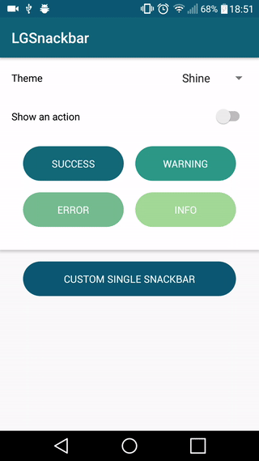

[](https://travis-ci.org/loregr/LGSnackbar)  [](./LICENSE.md)  [](https://jitpack.io/#loregr/lgsnackbar)
 


An easy to use wrapper of the native Android Snackbar which stays visible across multiple activities. It provides different themes to start with, and allows you to easily manage common scenarios like _**success**, **warning**, **error**, **info**._

## Preview

Demo video:



Try it on Appetize:

[](https://appetize.io/app/rp93kgkya9b02f4qb0vw2f8h4r?device=nexus5&scale=75&orientation=portrait&osVersion=7.0)

## Install

In your root/build.gradle:

```groovy
allprojects {
  repositories {
  ...
  maven { url 'https://jitpack.io' }
  }
}  
```
In your app/build.gradle

```groovy
dependencies {
  compile 'com.github.loregr:lgsnackbar:1.0.1'
}
```

## Preparing

### Setup with a default theme

Define your default theme using `LGSnackbarManager.prepare(...)`, in your `Application` class in the `#onCreate()` method.


```java
@Override
public void onCreate() {
    super.onCreate();
    LGSnackbarManager.prepare(getApplicationContext(),
                LGSnackBarThemeManager.LGSnackbarThemeName.SHINE);
                //....
}
```

**You can check the available themes _[here](./themes.md)_.**

_Note: You can simply call `LGSnackbarManager.prepare(getApplicationContext())`, in this case `SHINE` theme will be automatically applied._

### Setup with a custom theme

Create your own `LGSnackbarTheme` by passing 4 `LGSnackBarStyle` instances (one for each scenario of the theme) and the `minHeight` and the `duration` values that you want to apply to the Snackbar.


```java
@Override
public void onCreate() {
    super.onCreate();
    LGSnackbarManager.prepare(getApplicationContext(),
                    customTheme());
                //....
}

//...

LGSnackBarTheme customTheme() {
    LGSnackBarStyle successStyle = new LGSnackBarStyle(successCustomColor,
            Color.WHITE,
            actionSuccessCustomColor,
            R.drawable.ic_done_white);

    LGSnackBarStyle warningStyle = new LGSnackBarStyle(warningCustomColor,
            Color.WHITE,
            actionWarningCustomColor,
            R.drawable.ic_warning_white);

    LGSnackBarStyle errorStyle = new LGSnackBarStyle(errorCustomColor,
            Color.WHITE,
            actionErrorCustomColor,
            R.drawable.ic_error_outline_white);

    LGSnackBarStyle infoStyle = new LGSnackBarStyle(infoCustomColor,
            Color.WHITE,
            actionInfoCustomColor,
           R.drawable.ic_info_outline_white);

    return new LGSnackBarTheme(successStyle, warningStyle, errorStyle, infoStyle, 60, Snackbar.LENGTH_LONG);
}
```

## Usage

After preparing is done, in order to show a snackbar you can simply call:

```java
LGSnackbarManager.show(SUCCESS, "Everything is looking good! Awesome!");
```

Woooo, done! :-)

### Callbacks and actions

You can add a callback and/or an action to your snackbar by calling:

_Callback:_
```java
LGSnackbarManager.show(SUCCESS, "Everything is looking good! Awesome!",
  new Snackbar.Callback() {
      @Override
      public void onShown(Snackbar sb) {
          super.onShown(sb);
          // LGSnackbar is now visible
      }

      @Override
      public void onDismissed(Snackbar transientBottomBar, int event) {
          super.onDismissed(transientBottomBar, event);
          // LGSnackbar is now hidden
      }
});
```
_Action:_
```java
LGSnackbarManager.show(SUCCESS, "Everything is looking good! Awesome!",
  new LGSnackbarAction("Action", new View.OnClickListener() {
     @Override
     public void onClick(View view) {
       // Action fired
     }
}));
```
### Custom snackbar
If for any reason you may need to display a custom snackbar without setting a whole new theme, you can use an `LGSnackbarBuilder`

```java
new LGSnackbar.LGSnackbarBuilder(getApplicationContext(), "This is a custom bar")
        .duration(Snackbar.LENGTH_LONG)
        .actionTextColor(Color.GREEN)
        .backgroundColor(Color.GRAY)
        .minHeightDp(50)
        .textColor(Color.WHITE)
        .iconID(R.drawable.ic_info_outline_white)
        .callback(null)
        .action(null)
        .show();
```

#####  Supported Attributes

| Attribute        | Description      | Default value  |
| ------------- |-------------| -----|
| style      | An _LGSnackBarStyle_ instance     | Native Android snackbar style |
| duration      | How long to display the message. Either _LENGTH&#95;SHORT_ or _LENGTH&#95;LONG_     | _LENGTH&#95;LONG_ |
| backgroundColor      | The color of the snackbar     | Native Android color |
| actionTextColor      | The color of the text of an action     | Native Android color |
| textColor      | The color of the text     | white |
| minHeightDp      | The height of the snackbar when only one line if text is displayed     | 48 |
| iconID      | The drawable id of the icon     | _NO&#95;ICON&#95;ID_ (-1) |
| callback      | The snackbar callback     | _null_ |
| action      | The snackbar action     | _null_ |

## Issues


Feel free to submit issues and features requests.

## Contributing

Contributions are more then welcome. Your contribution may include bug fixing, new features or just new themes.

Please follow the "fork-and-pull" Git workflow (check [here](./CONTRIBUTING.md) for more).

 1. **Fork** the repo on GitHub
 2. **Clone** the project to your own machine
 3. **Commit** changes to your own branch
 4. **Push** your work back up to your fork
 5. Submit a **Pull request** so that I can review your changes


 If you contribute with a new theme, please update also the `themes.md` file.

_NOTE: Be sure to merge the latest from "upstream" before making a pull request!_

## Author

Lorenzo Greco

- [Website](https://lorenzogreco.com)
- [LinkedIn](https://www.linkedin.com/in/lorenzo-greco-61118195/)

## License
```
MIT License

Copyright (c) 2017 Lorenzo Greco

Permission is hereby granted, free of charge, to any person obtaining a copy
of this software and associated documentation files (the "Software"), to deal
in the Software without restriction, including without limitation the rights
to use, copy, modify, merge, publish, distribute, sublicense, and/or sell
copies of the Software, and to permit persons to whom the Software is
furnished to do so, subject to the following conditions:

The above copyright notice and this permission notice shall be included in all
copies or substantial portions of the Software.

THE SOFTWARE IS PROVIDED "AS IS", WITHOUT WARRANTY OF ANY KIND, EXPRESS OR
IMPLIED, INCLUDING BUT NOT LIMITED TO THE WARRANTIES OF MERCHANTABILITY,
FITNESS FOR A PARTICULAR PURPOSE AND NONINFRINGEMENT. IN NO EVENT SHALL THE
AUTHORS OR COPYRIGHT HOLDERS BE LIABLE FOR ANY CLAIM, DAMAGES OR OTHER
LIABILITY, WHETHER IN AN ACTION OF CONTRACT, TORT OR OTHERWISE, ARISING FROM,
OUT OF OR IN CONNECTION WITH THE SOFTWARE OR THE USE OR OTHER DEALINGS IN THE
SOFTWARE.
```
